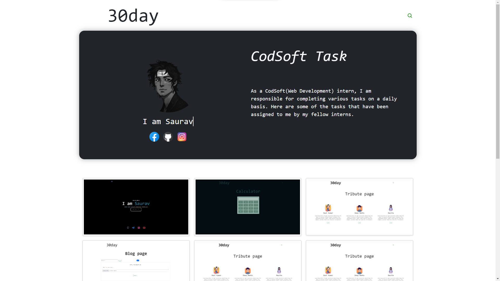
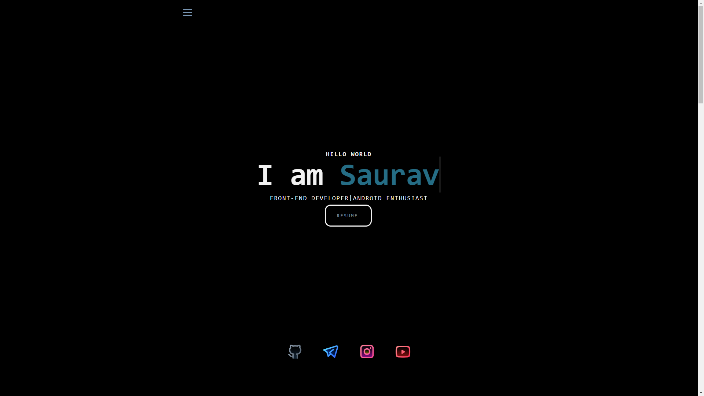

# CodSoft Internship Program

**CODSOFT** is a vibrant and diverse community that brings
together individuals with similar objectives and ultimate goals.
Our main focus is on creating opportunities that span various
areas, including leadership development, learning, student
engagement, and fostering shared interests.
We believe in the power of leadership and its ability to drive
positive change. That's why we provide platforms and resources
for our community members to develop their leadership skills.
Through mentorship programs, workshops, and collaborative
projects, we empower individuals to take on leadership roles and
make a difference in their respective fields.

# Web Development

**Web development** internship that provides practical work experience and an introduction to crafting and enhancing web-based systems. This opportunity offers engaging challenges and real-world projects, allowing you to gain hands-on experience in the dynamic fields of web and app development. Join our award-winning innovation team and kickstart your journey to success in a supportive and enriching environment.

[**Demo**](https://sauravrwt.github.io/CodSoft-Internship/)

# All Tasks

**•** [**Task-1(Landing page)**](https://github.com/SauRavRwT/CodSoft-Internship/tree/main/Task-1(Landing%20page))

This landing page is created using Bootstrap 5 with a Firebase backend, specifically for the contact form.

**•** [**Task-2(Portfolio)**](https://github.com/SauRavRwT/CodSoft-Internship/tree/main/Task-2(Portfolio))

**•** [**Task-2(Portfolio)** - _Personal_ ](https://github.com/SauRavRwT/sauravrwt.github.io/)

Once the layout is designed using Figma, it can be implemented using HTML, CSS, and JS. This will provide basic details about me, such as name, age, and occupation. The layout will be designed in a visually appealing manner, utilizing HTML for the structure, CSS for styling, and JS for any interactive elements. This combination of technologies will allow for a dynamic and user-friendly layout that effectively showcases your personal information.

**•** [**Task-3(Calculator)**](https://github.com/SauRavRwT/CodSoft-Internship/tree/main/Task-3(Calculator))

This Calculator is created using Bootstrap 5 with a vanilla js. Does basic calculations like Addition, Subtraction, Multiplication, and Division operations.

**•** [**Task-4(Tribute page)**](https://github.com/SauRavRwT/CodSoft-Internship/tree/main/Task-4(Tribute%20page))

This tribute page is created using Bootstrap 5 with basic knowledge of HTML and CSS.

**•** [**Task-5(blog page)**](https://github.com/SauRavRwT/CodSoft-Internship/tree/main/Task-5(blog%20page))

The layout of this blog page is designed using Bootstrap 5. It incorporates a Firebase authorization system, allowing users to log in and access the content. Additionally, the page utilizes realtime data from Firebase, enabling dynamic updates and interactions with the blog content.    

<!-- Ways to reach me -->
> ___If you like my projects, Give them ⭐ and Share it with friends!___

> Made with ❤️ in India